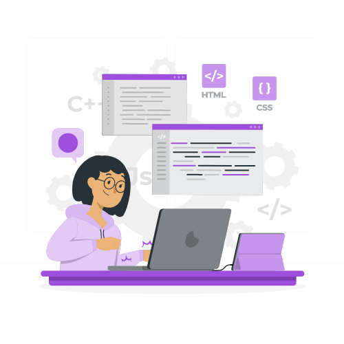

<a name="readme-top"></a>

<div align="center">
  

#  **Official portfolio**
This portfolio showcases my skills and expertise in software development. It includes a collection of some of my projects. 

---
  <br/>
  <br/>
  <br/>
</div>

<!-- TABLE OF CONTENTS -->
## <b>Table of Contents 📗
- [**Official portfolio**](#official-portfolio)
  - [Table of Contents 📗](#table-of-contents-)
  - [**Built With 🛠**](#built-with-)
    - [**Key Features 🏷️** ](#key-features-️-)
  - [Live Demo 🚀](#live-demo-)
  - [**Prerequisites 🧱**](#prerequisites-)
  - [**Setup ⚙️**](#setup-️)
  - [\*\* 🏗️ Install dependencies\*\*](#-️-install-dependencies)
  - [**Usage 📂**](#usage-)
  - [**Authors 👤**](#authors-)
  - [**Contributing 🤝**](#contributing-)
  - [**Show your support 🌟**](#show-your-support-)
  - [**Acknowledgments 🙏**](#acknowledgments-)
  - [**FAQ ❓**](#faq-)
  - [License 📝](#license-)

---
<!-- BUILT WITH -->
## **Built With 🛠**<a name="built-with"></a><br>

  <ul>
    <li><a href="https://developer.mozilla.org/en-US/docs/Web/HTML">HTML5</a> markup to build raw structure of this web page</li><br>
    <li><a href="https://developer.mozilla.org/en-US/docs/Web/CSS">CSS3</a> custom properties, <a href="https://css-tricks.com/snippets/css/a-guide-to-flexbox/">FlexBox</a>, <a href="https://www.w3schools.com/css/css_grid.asp">Grid</a> to make the website visually attractive</li><br>
    <li><a href="https://reactjs.org/">Javascript</a></li><br>
    <li><a href="https://mozilla.github.io/addons-linter/">Linters</a> for coding convention and coding formating</li>
  </ul>

<br>

---
<!-- KEY FEATURES -->
### **Key Features 🏷️** <a name="key-features"></a>

This portfolio showcases my skills and a list of some of my projects.

<p align="right">(<a href="#readme-top">back to top</a>)</p>
<br>

---
<!-- LIVE DEMO -->
## <b>Live Demo 🚀</b><a name="live-demo"></a>

If you want to check the live demo of my portfolio, please click 😊 [here](https://mariegrace31.github.io/Meal_Gallery/dist/).

<p align="right">(<a href="#readme-top">back to top</a>)</p>

---
<!-- PREREQUISITIES -->
## **Prerequisites 🧱**<a name="prerequisites"></a>

In order to run this project you need:

- A Github account
- Node JS
- A web browser to view output e.g [Microsoft Edge](https://www.microsoft.com/en-us/edge).
- An IDE e.g [Visual studio code](https://code.visualstudio.com/).
- [A terminal](https://code.visualstudio.com/docs/terminal/basics).

<br>

---
<!-- SETUP -->
## **Setup ⚙️**<a name="setup"></a>

Clone this repository:<br>
```sh
git clone https://github.com/mariegrace31/official_portfolio.git

```
Navigate to the folder
```
cd official_portfolio
```
Checkout the branch
```
git checkout dev
```
<br>

---
<!-- INSTALL -->
## ** 🏗️ Install dependencies**<a name="install"></a>

Install all dependencies by running:

```sh
npm install
```
Run the following code to fixed possible JavaScript linter errors:
```
npx eslint . --fix
```
<br>

---
<!-- USAGE -->
## **Usage 📂**<a name="usage"></a>
Open the page in the browser with:
```sh
$ npm start
```
<p align="right">(<a href="#readme-top">back to top</a>)</p>
<br>

---
<!-- AUTHORS -->
## **Authors 👤**<a name="author"></a>
👤 **Marie-Grace Bahati**
- GitHub: [@mariegrace31](https://github.com/mariegrace31)
- Twitter: [@mariegracebmg](https://twitter.com/mariegracebmg)
- LinkedIn: [Marie Grace Bahati](https://linkedin.com/in/marie-gr%C3%A2ce-bahati-546765224)
<p align="right">(<a href="#readme-top">back to top</a>)</p>

<br>

---
<!-- CONTRIBUTING -->
## **Contributing 🤝**<a name="contributing"></a>

If you have suggestions 📝, ideas 🤔, or bug reports 🐛, please feel free to open an [issue](https://github.com/mariegrace31/official_portfolio/issues) on GitHub.
Remember, every contribution, no matter how big or small, makes a difference.

<p align="right">(<a href="#readme-top">back to top</a>)</p>

<br>

---
<!-- SUPPORT -->
## **Show your support 🌟**<a name="support"></a>

Thank you for taking the time to explore my GitHub project! Your support means a lot to me. If you find my project valuable and would like to contribute, here are a few ways you can support me:

 - **Star the project ⭐️**: Show your appreciation by starring this GitHub repository. It helps increase visibility and lets others know that the project is well-received.

 - **Fork the project 🍴 🎣**: If you're interested in making improvements or adding new features, feel free to fork the project. You can work on your own version and even submit pull requests to suggest changes.

 - **Share with others 🗺️**: Spread the word about this project. Share it on social media, mention it in relevant forums or communities, or recommend it to colleagues and friends who might find it useful.

<p align="right">(<a href="#readme-top">back to top</a>)</p>

<br>

---
<!-- ACKNOWLEDGEMENTS -->
## **Acknowledgments 🙏**<a name="acknowledgements"></a>

We would like to express our sincere gratitude to [Microverse](https://github.com/microverseinc), the dedicated reviewers, and collaborators. Your unwavering support, and feedbacks have played an immense role in making this journey a resounding success. Thank you for being an integral part of our achievements.

<p align="right">(<a href="#readme-top">back to top</a>)</p>

---
<!-- FAQ -->
## **FAQ ❓**<a name="faq"></a>

- **Why should we use linters?**

  Because linters help you catch potential bugs and issues before they become serious problems, and encourage you to write more maintainable and readable code.

<p align="right">(<a href="#readme-top">back to top</a>)</p>

<br>

---
<!-- LICENCE -->
## <b>License 📝</b><a name="license"></a>

This project is [MIT](./LICENSE) licensed.

<p align="right">(<a href="#readme-top">back to top</a>)</p>